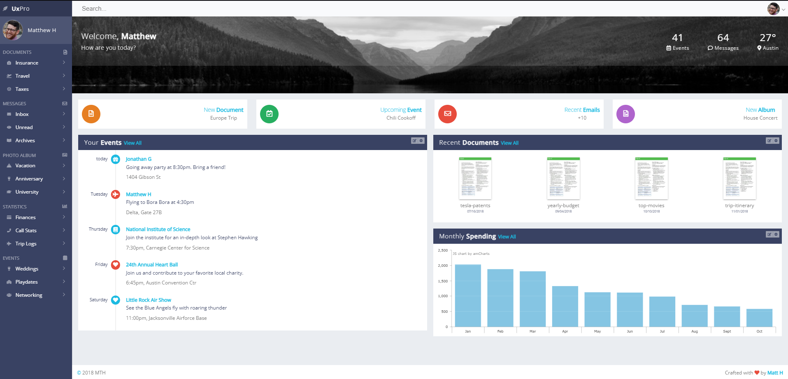

<p align="center">
	
</p>

# Assessment

## Exercício 01

### Dashboard Pessoal

O seu objetivo neste trabalho é implementar um dashboard, que pode ter vários tipos de uso.  No nosso caso usado para administrar eventos, documentos, emails, gastos, álbuns etc. Busque implementar com o layout parecido para cada componente conforme a imagem abaixo mas não precisa das mesma propriedades de cores, bordas, etc. 



Esta página deve conter:

1. Usando componente com css externo. Aplicar ao [main-header]
1. Usando componente com css inline. Aplicar ao [sidenav]
1. Usando componente com CSS Modules. Aplicar ao [main-overview e overview-card]
1. Usando componente com Styled Component. [Main-Cards e Card]

# IMPORTANTE: 
1. A página tem que estar responsiva.
1. Em telas pequenas, deve-se ter apenas uma coluna e retirar o que não for relevante e esconder o menu.
1. A página deve ser toda componentizada.
1. Não pode haver o uso de bibliotecas CSS(MUI, bootstrap, etc.).

```
Trabalhamos em sala e no TP3 nesse dashboard, porém agora você tem uma outra condição: os elementos da sua página, quando possível e útil, devem ser componentes React e todos os elementos que se repetem na mesma, como a relação de amigos, devem ser criados pela reutilização de um componente.
```
_Abuse da criatividade._

_Pense **Mobile-First**._
